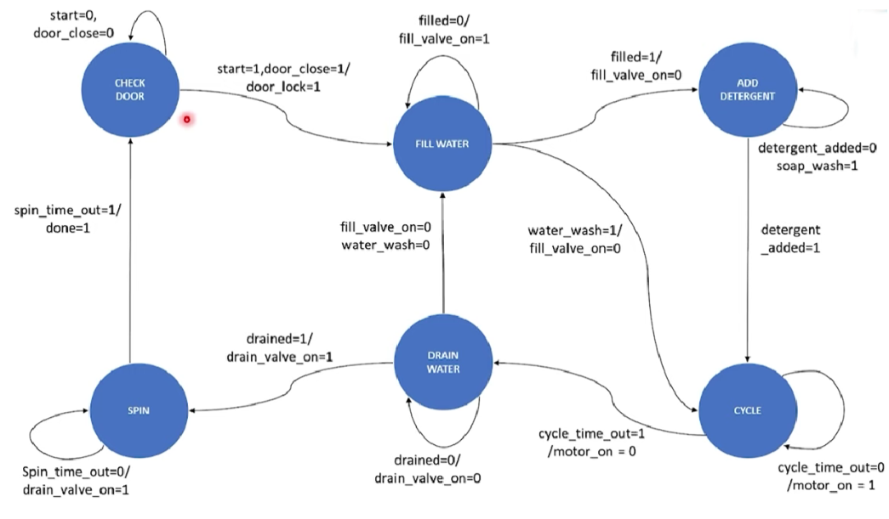

The goal of this project is to implement an automatic washing machine using Verilog HDL (Hardware Description Language). The system is designed to simulate the operation of a washing machine, managing various stages of the washing process such as filling, washing, draining, and spinning. The project includes several modules that work together to model the complete washing machine cycle.

# Flowchart

 
 

 
 

# output

